<div align="center">

```
  ____  _          _   ___ _____   ____             __ _ _
 |  _ \(_)_  _____| | |_ _|_   _| |  _ \ _ __ ___ / _(_) | ___
 | |_) | \ \/ / _ \ |  | |  | |   | |_) | '__/ _ \ |_| | |/ _ \
 |  __/| |>  <  __/ |  | |  | |   |  __/| | | (_) |  _| | |  __/
 |_|   |_/_/\_\___|_| |___| |_|   |_|   |_|  \___/|_| |_|_|\___|
```

**픽셀 아트 IT 프로필 카드 생성기**
뱀이 당신의 IT 도메인 태그들을 연결하며 기어다닙니다 🐍

[](https://vercel.com/new/clone?repository-url=https%3A%2F%2Fgithub.com%2Ftmuchal%2FPixel-ITProfile)

</div>

---

## 🎬 미리보기

<div align="center">

**PM · AI 전략가** (`cyberpunk`)



**AI Engineer** (`matrix`)



**Frontend Dev** (`synthwave`)



**DevOps** (`ocean`)



**뱀 단독 (`/api/snake`)**


</div>

---

> **왜 만들었냐?**
> [pixel-profile](https://github.com/LuciNyan/pixel-profile) 은 GitHub 통계 숫자만 보여줌.
> 커밋 수가 적은 PM, 기획자, AI 도메인 전문가에게는 의미없는 숫자들.
> **당신이 어떤 IT인인지**를 보여주는 카드가 필요했다.
> 거기에 + 뱀이 도메인 태그들을 연결하는 애니메이션.

---

## ✨ 특징

| | |
|---|---|
| 🎭 **IT 정체성 중심** | 역할(PM / AI Engineer / DevOps) + 도메인 태그 |
| 🐍 **뱀 weaving 애니메이션** | `<animateMotion>` + Bezier 경로로 배지 사이를 진짜로 구불구불 통과 |
| ✨ **SVG 네온 글로우** | `<feGaussianBlur>` 필터로 실제 CRT/네온 느낌 |
| ⌨️ **타이핑 애니메이션** | SVG SMIL `<animate>` clip-path reveal로 이름이 타이핑되며 등장 |
| 📊 **GitHub 통계** | 토큰 있을 때 선택 표시, 없어도 완전 동작 |
| 🎨 **12가지 테마** | matrix / cyberpunk / synthwave / tokyonight / monokai... |
| 🇰🇷 **한글 지원** | 한글 이름·소개 완전 지원 |
| ⚡ **Edge Runtime** | Vercel Edge로 전세계 빠른 응답 |

---

## 🚀 30초 시작

**GitHub `README.md`에 한 줄만 붙여넣으면 됩니다:**

```markdown

```

**뱀 단독 사용 (contribution graph 위에 올리기):**

```markdown

```

---

## 🎨 테마 갤러리

| 테마 | 설명 |
|------|------|
| `matrix` | 클래식 그린 터미널 |
| `cyberpunk` | 핫핑크 + 사이안 |
| `synthwave` | 레트로 보라 + 분홍 |
| `tokyonight` | VS Code 인기 테마 |
| `dracula` | 다크 드라큘라 |
| `monokai` | 웜 에디터 테마 |
| `ocean` | 딥 오션 청록 |
| `nord` | 북유럽 블루 |
| `terminal` | 앰버 레트로 터미널 |
| `hacker` | 순수 블랙 + 그린 |
| `neon` | 사이안 + 마젠타 |
| `retro` | CRT 호박색 |

---

## ⚙️ 파라미터 전체 목록

### 🧑‍💻 IT 정체성 (핵심)

| 파라미터 | 설명 | 예시 |
|---------|------|------|
| `name` | 표시 이름 | `김철수` |
| `username` | GitHub 유저명 (아바타 자동 fetch) | `yourname` |
| `role` | IT 역할/직군 | `PM`, `AI Engineer`, `Full Stack Dev` |
| `domains` | IT 도메인 태그 (쉼표 구분, 최대 8개) | `AI,Enterprise,Agent,Blockchain` |
| `bio` | 한 줄 소개 | `관련없어보이는것들을연결하는사람` |

### 🐍 뱀 애니메이션

| 파라미터 | 설명 | 기본값 |
|---------|------|--------|
| `snake_speed` | 속도 | `slow` / `normal` / `fast` |
| `snake_color` | 몸 색 (#hex) | 테마 기본값 |
| `food_color` | 먹이 색 (#hex) | 테마 기본값 |
| `show_snake` | 표시 여부 | `true` |

### 🎨 디자인

| 파라미터 | 설명 | 기본값 |
|---------|------|--------|
| `theme` | 색상 테마 | `matrix` |
| `layout` | `wide` (800px) / `compact` (600px) | `wide` |
| `bg_color` | 배경색 override | 테마 기본값 |
| `accent_color` | 강조색 override | 테마 기본값 |
| `border_color` | 테두리색 override | 테마 기본값 |
| `text_color` | 텍스트색 override | 테마 기본값 |

### 📊 GitHub 연동 (선택)

| 파라미터 | 설명 |
|---------|------|
| `show_stats` | GitHub 통계 표시 (기본 `false`, 토큰 필요) |
| `show_avatar` | 아바타 표시 (기본 `true`) |

---

## 💡 예시 모음

### PM · AI 전략가
```markdown

```

### Frontend Developer
```markdown

```

### AI / ML Engineer
```markdown

```

### DevOps / Platform Engineer
```markdown

```

### GitHub 통계 포함 (토큰 필요)
```markdown

```

---

## 🚀 내 서버에 배포하기

### Vercel (권장)

[](https://vercel.com/new/clone?repository-url=https%3A%2F%2Fgithub.com%2Ftmuchal%2FPixel-ITProfile)

1. 위 버튼 클릭 → Vercel에 Fork + 자동 배포
2. *(선택)* 아바타·통계 사용 시 환경변수 추가:
   - Vercel Dashboard → Settings → Environment Variables
   - `GITHUB_TOKEN` = `ghp_your_token_here`
3. 배포 URL로 README에 사용:
   ```
   https://YOUR-APP.vercel.app/api/profile?...
   ```

**GitHub Personal Access Token 생성:**
[github.com/settings/tokens](https://github.com/settings/tokens) → `read:user`, `repo` 권한

### Docker

```bash
docker build -t pixel-itprofile .
docker run -p 3000:3000 -e GITHUB_TOKEN=ghp_xxx pixel-itprofile
```

---

## 🤖 GitHub Actions 자동 업데이트

매일 프로필 카드를 자동 생성해서 레포에 저장 → README에서 로컬 파일 참조:

```markdown
<!-- README.md에서 이렇게 사용 -->


```

`.github/workflows/update-profile.yml`이 이미 포함되어 있습니다.

**설정:**
1. 레포 Settings → Secrets → `PIXEL_ITPROFILE_URL` 추가
   ```
   https://YOUR-APP.vercel.app/api/profile?name=김철수&theme=cyberpunk&...
   ```
2. 매일 자정 자동 실행 + Actions 탭에서 수동 트리거 가능

---

## 🛠 로컬 개발

```bash
git clone https://github.com/tmuchal/Pixel-ITProfile
cd Pixel-ITProfile
npm install
cp .env.example .env.local
npm run dev
```

테스트:
```
http://localhost:3000                     ← 인터랙티브 데모 페이지
http://localhost:3000/api/profile?name=테스트&role=PM&domains=AI,Agent&theme=cyberpunk
http://localhost:3000/api/snake?theme=matrix
```

---

## 📁 프로젝트 구조

```
src/
├── app/
│   ├── api/
│   │   ├── profile/route.ts   ← 메인 프로필 카드 (SVG)
│   │   └── snake/route.ts     ← 뱀 단독 (SVG)
│   ├── demo-client.tsx        ← 인터랙티브 데모 (React 클라이언트)
│   ├── page.tsx
│   └── layout.tsx
└── lib/
    ├── card.ts                ← SVG 카드 생성기 ★ 핵심
    │   ├── buildDefs()         SVG 필터 (네온 글로우, 스캔라인)
    │   ├── buildBorder()       픽셀 아트 코너 장식 + 터미널 라벨
    │   ├── buildSnakeWeave()   animateMotion + Bezier 경로 뱀
    │   ├── buildTypingText()   SMIL clip-path 타이핑 애니메이션
    │   └── buildStats()        픽셀 프로그레스 바
    ├── themes.ts              ← 12가지 테마 정의
    ├── github.ts              ← GitHub GraphQL API
    └── types.ts               ← TypeScript 타입
```

---

## 🤝 새 테마 추가 PR 환영

`src/lib/themes.ts`에 테마 추가 후 PR 보내주세요:

```typescript
my_theme: {
  bg: '#000000',      // 배경색
  bg2: '#111111',     // 보조 배경색
  text: '#ffffff',    // 기본 텍스트
  accent: '#ff6600',  // 강조색 (배지 테두리, 글로우)
  subtext: '#888888', // 보조 텍스트 (보이는 밝기로!)
  border: '#ff6600',
  badge: '#1a0a00',
  badgeText: '#ff6600',
  snake: '#ffaa00',   // 뱀 몸
  snakeHead: '#ffdd00', // 뱀 머리
  food: '#ff0000',    // 먹이
},
```

---

<div align="center">

Made with 🐍 pixels and too much caffeine

Inspired by [pixel-profile](https://github.com/LuciNyan/pixel-profile) · Snake concept from [Platane/snk](https://github.com/Platane/snk)

</div>
