<div align="center">

# 🐱 Pixel IT Profile

**GitHub README에 붙이는 픽셀 아트 고양이 방 IT 프로필 카드**

주황색 픽셀 고양이가 방을 돌아다니며 코딩, 커피, TV, 수면을 반복하는 40초 루프 애니메이션.

[](https://vercel.com/new/clone?repository-url=https%3A%2F%2Fgithub.com%2Ftmuchal%2FPixel-ITProfile)

</div>

---

## 미리보기

**paris** (cyberpunk 테마)


**dubai** (sunset 테마)


**night** (dracula 테마)


---

## 쓰는 법

### 1. Vercel 배포

[](https://vercel.com/new/clone?repository-url=https%3A%2F%2Fgithub.com%2Ftmuchal%2FPixel-ITProfile)

버튼 클릭 → 배포하면 `https://your-app.vercel.app` 주소가 생긴다.

### 2. 내 GitHub README에 붙여넣기

```markdown

```

`scene`과 `theme`을 원하는 값으로 바꾸면 끝.

---

## 파라미터

| 파라미터 | 옵션 | 기본값 |
|---------|------|--------|
| `scene` | `paris` `dubai` `italy` `night` | `night` |
| `theme` | `matrix` `cyberpunk` `synthwave` `ocean` `sunset` `nord` `dracula` `solarized` | `matrix` |
| `width` | 최대 `1200` | `800` |
| `height` | 최대 `300` | `150` |

---

## 로컬 실행

```bash
git clone https://github.com/tmuchal/Pixel-ITProfile
npm install
npm run dev
# http://localhost:3000 에서 확인
```

---

<div align="center">
Made with 🐱 orange pixels
</div>
